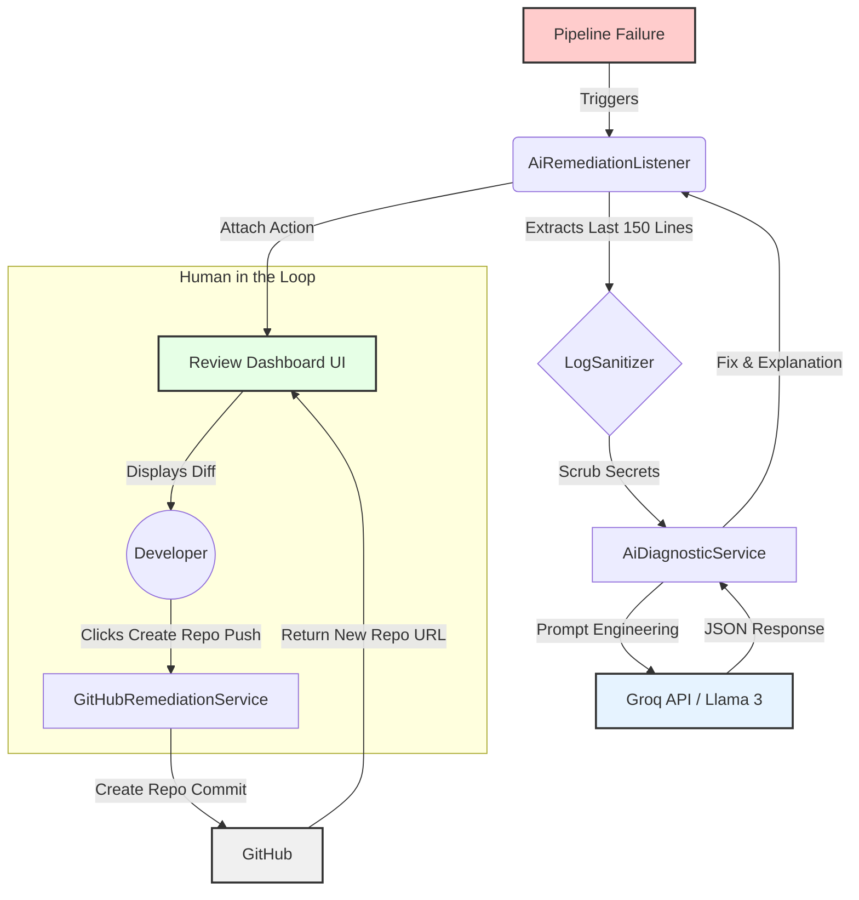

🤖 Jenkins AI Remediation Plugin

Autonomous Pipeline Diagnosis & Repair powered by Groq Llama 3

This Jenkins plugin automatically intercepts pipeline failures, analyzes the build logs using a Large Language Model (Groq/Llama 3), and proactively generates a fixed version of your code. It provides a Human-in-the-Loop (HITL) interface where you can review the AI's proposed fix before one-click pushing it to a new GitHub repository.

🧠 Logical Workflow

✨ Features

Auto-Detection: Automatically catches Result.FAILURE events in Pipelines.

Secure Analysis: Logs are sanitized (secrets masked) before sending to the AI.

Structured Output: Forces the AI to return structured JSON (Explanation, FileName, FixedCode).

Visual Diff: Integrated diff2html viewer to compare original vs. AI-suggested code.

Automated Git Ops: Creates a brand new repository (e.g., jenkins-job-fail-test) and commits the fix with a single click.

🛠️ Configuration

Prerequisites

Jenkins: Version 2.479.3 or newer (Jakarta EE support).

Java: JDK 17 or newer.

Global Setup

Navigate to Manage Jenkins > Credentials.

Add Groq API Key (Secret Text).

Add GitHub Personal Access Token (Secret Text, must have repo scope).

Navigate to Manage Jenkins > System.

Scroll to AI Remediation Plugin.

Select your Groq Credential ID.

Select your GitHub Credential ID.

(Optional) Set the model name (default: llama-3.3-70b-versatile).

🚀 Development

Build & Run

# Clean build to ensure Jakarta dependencies are resolved
mvn clean hpi:run -Dport=8090

Installation

Run mvn clean package.

Upload target/ai-remediation.hpi to your Jenkins instance via Manage Jenkins > Plugins > Advanced.

🔒 Security Note

This plugin sends build logs to an external API (Groq). While the LogSanitizer attempts to scrub patterns resembling keys and tokens, always review what data your pipelines output to the console.